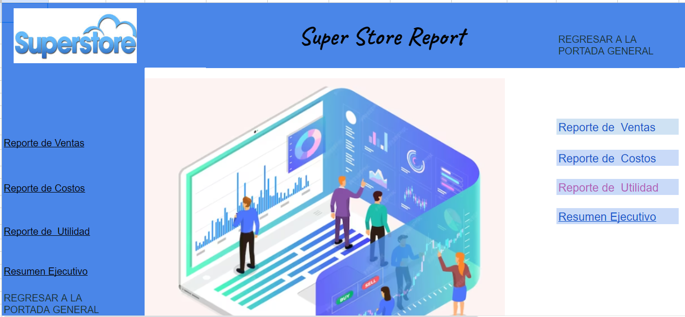
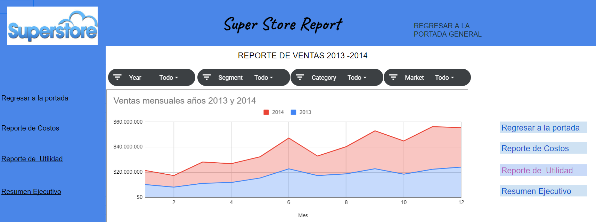
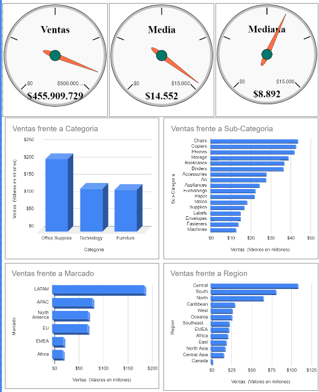
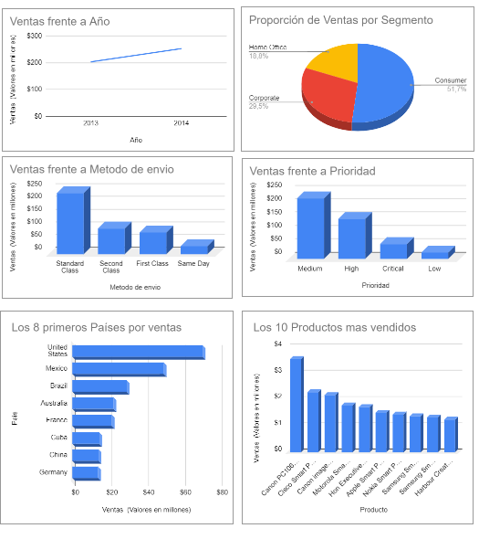

La empresa Global Super Store, líder en ventas de productos en línea a nivel internacional, se propuso mejorar la eficiencia de sus operaciones mediante el análisis de datos.

Me han contratado como DA para que lleve adelante este estudio, para lo que me han suministrado detalles de pedidos realizados de forma online por personas de todo el mundo en el período comprendido entre el 1 de enero de 2013 y el 31 de diciembre de 2014.

El desafío es desarrollar las etapas de un proyecto de DA desde los procesos de ETL necesarios  para el análisis exploratorio hasta la presentación de resultados mediante informes y Dashboard interactivo en Spreadsheets.

Puedes encontrar todo el proyecto en https://docs.google.com/spreadsheets/d/1h3C7gDimmtwoe5n7fcvPcFVFXI1x_U_EOGXuyyPy4gM/edit?usp=sharing

