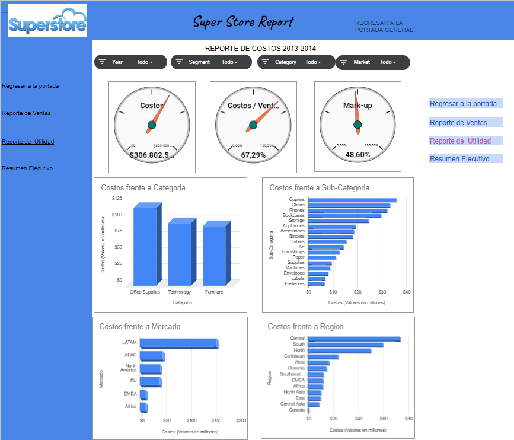

# 🌐 Global Super Store Data Analysis Project

## 📖 Executive Summary / Resumen Ejecutivo

The **Global Super Store Data Analysis Project** was initiated to improve the efficiency of international online operations by leveraging advanced data analysis techniques. As a Data Analyst, I was tasked with analyzing customer orders placed worldwide between **January 1, 2013**, and **December 31, 2014**, to uncover actionable insights and present results through interactive dashboards in **Google Spreadsheets**.  
El **Proyecto de Análisis de Datos de Global Super Store** se inició para mejorar la eficiencia de las operaciones internacionales en línea mediante técnicas avanzadas de análisis de datos. Como Analista de Datos, mi labor consistió en analizar pedidos realizados a nivel mundial entre el **1 de enero de 2013** y el **31 de diciembre de 2014**, para descubrir información clave y presentar los resultados a través de dashboards interactivos en **Google Spreadsheets**.

---

## 🎯 Project Objectives / Objetivos del Proyecto

1. **End-to-End Data Analysis**  
   - Perform **ETL processes** (Extract, Transform, Load) to prepare raw data for exploratory analysis.  
   - Ejecutar procesos **ETL** (Extracción, Transformación, Carga) para preparar los datos en bruto para el análisis exploratorio.

2. **Exploratory Data Analysis (EDA)**  
   - Investigate patterns, trends, and anomalies in the dataset to identify opportunities for operational improvement.  
   - Investigar patrones, tendencias y anomalías en el conjunto de datos para identificar oportunidades de mejora operativa.

3. **Interactive Dashboard Creation**  
   - Design and implement interactive dashboards in **Google Spreadsheets** to visualize key insights.  
   - Diseñar e implementar dashboards interactivos en **Google Spreadsheets** para visualizar información clave.

4. **Strategic Recommendations**  
   - Provide actionable insights to enhance decision-making processes for Global Super Store's online operations.  
   - Proporcionar información procesable para mejorar los procesos de toma de decisiones en las operaciones en línea de Global Super Store.

---

## 🛠️ Project Stages / Etapas del Proyecto

### 🚀 ETL Process
- **Data Extraction**: Gathered customer order data from various sources.  
  **Extracción de Datos**: Recolección de datos de pedidos de clientes desde diversas fuentes.
- **Data Transformation**: Cleaned and formatted the dataset to ensure consistency and reliability.  
  **Transformación de Datos**: Limpieza y formateo del conjunto de datos para garantizar consistencia y fiabilidad.
- **Data Loading**: Imported the cleaned data into Google Spreadsheets for analysis.  
  **Carga de Datos**: Importación de los datos limpios a Google Spreadsheets para su análisis.

### 📊 Exploratory Data Analysis (EDA)
- Conducted analysis to uncover patterns such as:
  - **Top-selling products** by category and region.  
  - **Seasonal trends** in sales and order volume.  
  - **Customer segmentation** based on purchase behavior.  
- Realización de análisis para descubrir patrones como:
  - **Productos más vendidos** por categoría y región.  
  - **Tendencias estacionales** en ventas y volumen de pedidos.  
  - **Segmentación de clientes** según su comportamiento de compra.

### 📈 Dashboard Creation
- Designed interactive visualizations to highlight key insights, including:
  - Sales performance by region and time period.  
  - Profitability analysis for product categories.  
  - Order trends and customer preferences.  
- Diseño de visualizaciones interactivas para resaltar información clave, incluyendo:
  - Rendimiento de ventas por región y período de tiempo.  
  - Análisis de rentabilidad por categorías de productos.  
  - Tendencias de pedidos y preferencias de clientes.

---

## 📊 Key Results / Resultados Clave

1. **Improved Operational Efficiency**  
   - Identified bottlenecks in order processing and proposed solutions to streamline operations.  
   - Identificación de cuellos de botella en el procesamiento de pedidos y propuestas de soluciones para optimizar las operaciones.

2. **Enhanced Customer Insights**  
   - Developed actionable segmentation strategies to target high-value customers.  
   - Desarrollo de estrategias de segmentación procesables para enfocarse en clientes de alto valor.

3. **Strategic Sales Insights**  
   - Provided recommendations to capitalize on high-demand product categories and regional opportunities.  
   - Recomendaciones para capitalizar categorías de productos de alta demanda y oportunidades regionales.

---

## 📂 Repository Contents / Contenido del Repositorio

- **Google Spreadsheet**: [Access the project here](https://docs.google.com/spreadsheets/d/1h3C7gDimmtwoe5n7fcvPcFVFXI1x_U_EOGXuyyPy4gM/edit?usp=sharing).  
  **Google Spreadsheet**: [Accede al proyecto aquí](https://docs.google.com/spreadsheets/d/1h3C7gDimmtwoe5n7fcvPcFVFXI1x_U_EOGXuyyPy4gM/edit?usp=sharing).

---

## 📋 Conclusions / Conclusiones

The **Global Super Store Data Analysis Project** successfully delivered actionable insights and a scalable solution to improve online operations. Through a comprehensive ETL process, exploratory data analysis, and interactive dashboards, this project empowered Global Super Store to make data-driven decisions that enhance operational efficiency, boost sales, and improve customer satisfaction.  
El **Proyecto de Análisis de Datos de Global Super Store** entregó con éxito información procesable y una solución escalable para mejorar las operaciones en línea. A través de un proceso completo de ETL, análisis exploratorio de datos y dashboards interactivos, este proyecto permitió a Global Super Store tomar decisiones basadas en datos que mejoran la eficiencia operativa, aumentan las ventas y optimizan la satisfacción del cliente.

---

## 🧩 Recommendations / Recomendaciones

- **Extend Data Scope**: Incorporate additional datasets, such as customer feedback or logistics data, to deepen analysis.  
  **Ampliar el Alcance de los Datos**: Incorporar conjuntos de datos adicionales, como retroalimentación de clientes o datos logísticos, para un análisis más profundo.

- **Automation**: Automate the ETL process for continuous data analysis and reporting.  
  **Automatización**: Automatizar el proceso ETL para análisis y reportes continuos.

- **Dashboard Enhancements**: Update dashboards regularly to reflect real-time performance metrics.  
  **Mejoras en Dashboards**: Actualizar los dashboards regularmente para reflejar métricas de rendimiento en tiempo real.

---

## 🤝 Contact / Contacto

For inquiries or further collaboration opportunities, please reach out:  
Para consultas o posibles oportunidades de colaboración, por favor contacta:  

📧 **Email:** [carlosfdussanr@gmail.com](mailto:carlosfdussanr@gmail.com)  
🔗 **LinkedIn:** [Carlos Dussán](https://www.linkedin.com/in/carlosfdussan/)  

